# Translation With a Sequence to Sequence Network and Attention

> by Krishna N Revi 

## Assignment ❔

1. Replace the embeddings of this session's code with GloVe embeddings
2. Compare your results with this session's code. 
3. Upload to a public GitHub repo and proceed to Session 10 Assignment Solutions where these questions are asked: 
   1. Share the link to your README file's public repo for this assignment. Expecting a minimum 500-word write-up on your learnings. Expecting you to compare your results with the code covered in the class. - 750 Points
   2. Share the link to your main notebook with training logs - 250 Points

## Solution 💡

Please refer to code file without GloVe embeddings [here](https://github.com/krishnarevi/TSAI_END2.0_Session10/blob/main/Frech_to_English_NMT_without_pretrained_embedding.ipynb)

Please refer to code file with GloVe embeddings [here](https://github.com/krishnarevi/TSAI_END2.0_Session10/blob/main/French_English_translation_with_pre_trained_embedding_Seq2Seq.ipynb)

##### What are Pretrained Word Embeddings?

*Pretrained Word Embeddings are the embeddings learned in one task that are used for solving another similar task.*

These embeddings are trained on large datasets, saved, and then used for solving other tasks. That’s why pretrained word embeddings are a form of **Transfer Learning. **Transfer learning, as the name suggests, is about transferring the learnings of one task to another. Learnings could be either weights or embeddings. In our case here, learnings are the embeddings. Hence, this concept is known as pretrained word embeddings.

##### Why do we need Pretrained Word Embeddings?

Pretrained word embeddings capture the semantic and syntactic meaning of a word as they are trained on large datasets. They are capable of boosting the performance of a Natural Language Processing model. 

Learning word embeddings from scratch is a challenging problem due to two primary reasons:

- Sparsity of training data
- Large number of trainable parameters

We can broadly divide the embeddings into 2 classes: **Word-level and Character-level embeddings**.

 ELMo and Flair embeddings are examples of Character-level embeddings. Here, we are going to use a popular word-level pretrained word embedding -Stanford’s GloVe. Gooogle’s Word2Vec is another popular word-level pretrained word embedding

Let’s understand the working of  GloVe.

##### Brief Introduction to GloVe: Global Vectors for Word Representation

GloVe is an unsupervised learning algorithm for obtaining vector representations for words. Training is performed on aggregated global word-word co-occurrence statistics from a corpus, and the resulting representations showcase interesting linear substructures of the word vector space. Simply put, GloVe allows us to take a corpus of text, and intuitively transform each word in that corpus into a position in a high-dimensional space. This means that similar words will be placed together.

The GloVe model is trained on the non-zero entries of a global word-word co-occurrence matrix, which tabulates how frequently words co-occur with one another in a given corpus. Populating this matrix requires a single pass through the entire corpus to collect the statistics. For large corpora, this pass can be computationally expensive, but it is a one-time up-front cost. Subsequent training iterations are much faster because the number of non-zero matrix entries is typically much smaller than the total number of words in the corpus.

The statistics of word occurrences in a corpus is the primary source of information available to all unsupervised methods for learning word representations, and although many such methods now exist, the question still remains as to how meaning is generated from these statistics, and how the resulting word vectors might represent that meaning.

GloVe observes that ratios of word-word co-occurrence probabilities have the potential for encoding some form of meaning. Take the example from StanfordNLP ([Global Vectors for Word Representation](https://nlp.stanford.edu/projects/glove/)), to consider the co-occurrence probabilities for target words ***ice\*** and ***steam\*** with various probe words from the vocabulary:

· As one might expect, ***ice\*** co-occurs more frequently with ***solid\*** than it does with ***gas\***, whereas ***steam\*** co-occurs more frequently with ***gas\*** than it does with ***solid\***.

· Both words co-occur with their shared property ***water\*** frequently, and both co-occur with the unrelated word ***fashion\*** infrequently.

Only in the ratio of probabilities does noise from non-discriminative words like ***water\*** and ***fashion\*** cancel out, so that large values (much greater than 1) correlate well with properties specific to ***ice\***, and small values (much less than 1) correlate well with properties specific of ***steam\***.

##### Comparison Seq2seq language translation model with and without Glove 

Here we would use Glove Word Embeddings, which has 40,000 words and available in 50,100,200,300 dimensions. We'll be using the "glove.6B.100d" vectors. 6B indicates these vectors were trained on 6 billion tokens and 100d indicates these vectors are 100-dimensional.

Before we load the vectors in code, we have to understand how the glove text file is formatted.
Each line of the text file contains a word, followed by *N* numbers. The *N* numbers describe the vector of the word’s position. *N* may vary depending on which vectors you downloaded, in case of  *glove.6B.100d.*, *N* is 100, 

Here is an example line from the text file, shortened to the first ten dimensions:

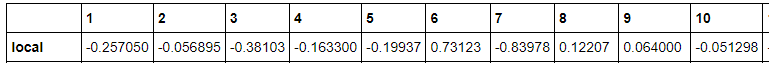

##### Training logs and Loss

Without glove embedding							With glove embedding

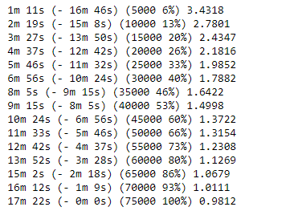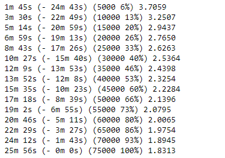

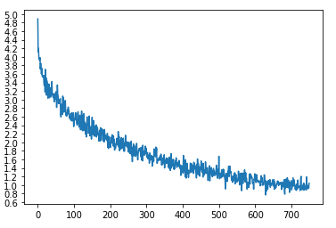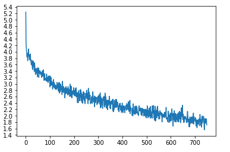

Sample predictions from model without glove embedding

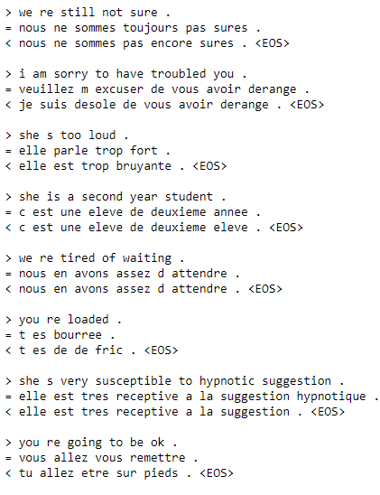

Sample predictions from model with glove embedding

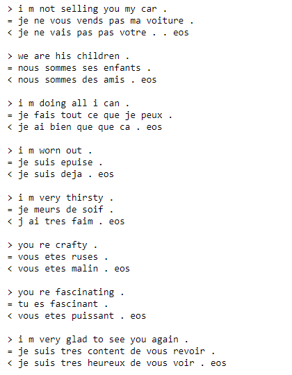

Visualize attentions for different predictions

Sample 1

Input : i m really proud of this

Actual output :j en suis vrariment fier 

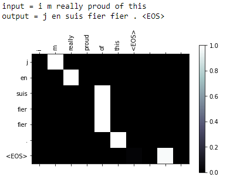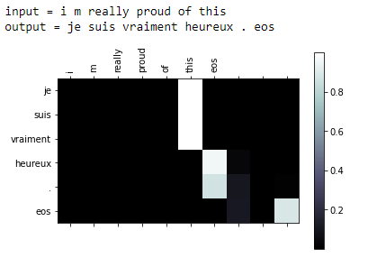

Sample 2

Input : They are out shopping 

Actual output : Ils sont faire les magasins

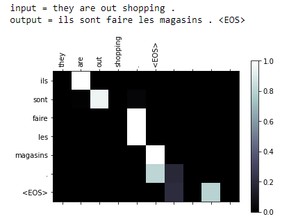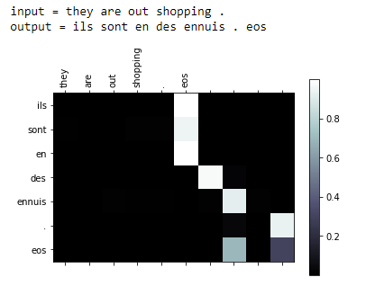

Sample 3

Input : He is an intelligent boy

Actual output : c est un garcon intelligent 

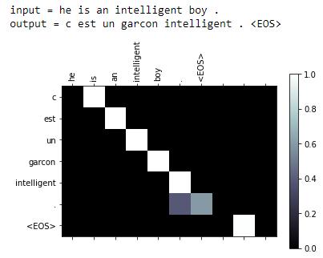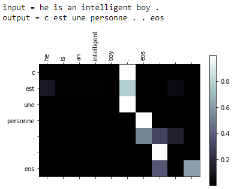

##### Why performance not improving ??

